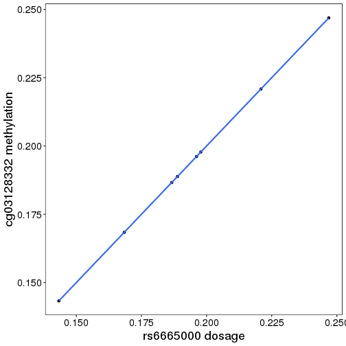
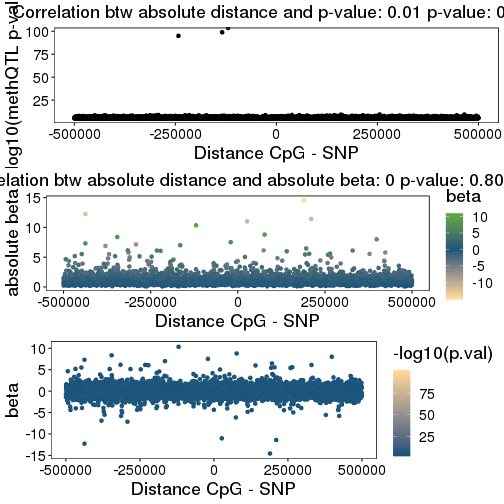

# Introduction

This vignette describes the *methQTL* R-package (https://github.com/MPIIComputationalEpigenetics/methQTL-package) available from GitHub. The package uses DNA methylation data obtained using the Illumina BeadArrays, and genotyping data from Illumina genotyping microarrays or whole genome sequencing to compute methylation quantitative trait loci (methQTL). The package provides mutliple flavors of linear modeling strategies to compute *methQTL* as statistically significant interactions between single nucleotide polymorphisms (SNPs) and changes in the DNA methylation state of individual CpGs. DNA methylation values at single CpGs are first summarized into correlation blocks, and a representative of this correlation block is used for methQTL calling.

# Installation

The package can be directly installed from GitHub, after installing the *devtools* package.


```r
if(!requireNamespace("devtools")) install.packages("devtools")
```

```
## Loading required namespace: devtools
```

```r
if(!requireNamespace("methQTL")){
  devtools::install_github("MPIIComputationalEpigenetics/methQTL-package")
}  
```

```
## Loading required namespace: methQTL
## Setting options('download.file.method.GEOquery'='auto')
## Setting options('GEOquery.inmemory.gpl'=FALSE)
## Warning: no function found corresponding to methods exports from 'RnBeads' for:
## 'samples'
```

```r
suppressPackageStartupMessages(library(methQTL))
```

# Input data

The *methQTL* package requires two types of data as input: DNA methylation data obtained using the Illumina Infinium BeadArrays and genotyping data obtained using genotyping microarrays or whole genome sequencing.

## DNA methylation data (microarrays)

The package utilizes the widely used [*RnBeads*](http://rnbeads.org/) software package for DNA methylation data import. It supports the various input options available in *RnBeads*, including a direct download from the Gene Expression Omnibus (GEO). For further options, we refer to the [RnBeads vignette](http://bioconductor.org/packages/release/bioc/vignettes/RnBeads/inst/doc/RnBeads.pdf) and documentation. In addition to the raw methylation data, a sample annotation sheet specifying the samples to be analyzed needs to be provided. The sheet contains a line for each sample and looks as follows:


```bash
SampleID,age,sex,barcode
Sample_1,14,f,209054857842_R01C01
Sample_2,42,f,209054857842_R02C01
Sample_3,45,m,209054857842_R03C01
```

For further details on the import process, we refer to the [RnBeads vignette](http://bioconductor.org/packages/release/bioc/vignettes/RnBeads/inst/doc/RnBeads.pdf). Most importantly, analysis options need to be specified for the import and preprocessing modules of *RnBeads*. *methQTL* provides a default setting, which is available in *extdata/rnbeads_options.xml*. You can use this file as a template for your own setting and then specify it to the methQTL package:


```r
opts <- rnb.xml2options(system.file("extdata/rnbeads_options.xml",package="methQTL"))
rnb.options(identifiers.column="ind_IPC")
xml.fi <- file.path(getwd(),"rnbeads_options.xml")
cat(rnb.options2xml(),file=xml.fi)
qtl.setOption(rnbeads.options = xml.fi)
```

To redefine the correlation blocks, we allow including additional information such as genome-wide segmentation of the methylation landscape (see option ```use.segmentation``` and function ```qtl.run.segmentation```), and also function annotation according to the Ensembl regulatory build [@Zerbino2015].

## Genotyping data

### PLINK files

The package supports data that has already been processed by *plink* and is available either in the form of binary *.bed*, *.bim* and *.fam* files, as *.ped* and *.map*, as variant calling files (*.vcf*), or as imputed files in the dosage format (*.dos*). For further processing, we use the command line tool *plink*, which comes with this package, but is only applicable on Linux systems. For Windows and MacOS users, please install the *plink* tool from [here](https://www.cog-genomics.org/plink/1.9/) and specify it using the option ```plink.path```. The sample identifier specified earlier also needs to match the sample IDs of the genotype calls.

### IDAT files

The package also support raw IDAT files and uses the [CRLMM](https://www.bioconductor.org/packages/release/bioc/html/crlmm.html) R-package, together with PLINK to perform genotype calling and data import. The package requires a single sample annotation sheet in the format described in the [DNA methylation data (microarray)](DNA methylation data) section. In addition to the column names specified above, a column named *GenoSentrixPosition* has to be added, which specifies the IDAT file IDs.


```bash
SampleID,age,sex,barcode,GenoSentrixPosition
Sample_1,14,f,209054857842_R01C01,9701756058_R05C01
Sample_2,42,f,209054857842_R02C01,9701756058_R07C01
Sample_3,45,m,209054857842_R03C01,9742011016_R04C01
```

### Imputation

Illumina SNP BeadArray data is typically imputed before further analysis, and the package allows for imputation through the [Michigan Imputation Server](https://imputationserver.sph.umich.edu/index.html#!). In order to be able to perform computation on the server, an account is required. After the account is created, one has to request an API token in the user settings and specify it to the package using the option ```imputation.user.token```. During the imputation process, the package will stall for a while and wait for the job to finish. After the job is done, the package will prompt for entering the password send via e-mail to the user account. The imputation process has to be split according to chromosomes, which is why multiple e-mails will be send to the account, and the imputation process can take up to several days. However, after imputation, the imputed data will be available as PLINK files, such that the imputation has to be performed only once. For preprocessing the data for upload to the imputation server, the package requires the [bgzip](http://www.htslib.org/doc/bgzip.html) and [tabix](http://www.htslib.org/doc/tabix.html) tools from the [htslib](http://www.htslib.org/) package. Also see further options to configure the imputation jobs (see the Michigan Imputation Server [documentation](https://imputationserver.readthedocs.io/en/latest/) for further information):


```r
qtl.setOption(
  impute.geno.data=TRUE,
  imputation.reference.panel="apps@hrc-r1.1",
  imputation.phasing.method="shapeit",
  imputation.population="eur"
)
```

## Perform data import

The ```do.import``` function requires the paths to the respective genotyping and DNA methylation data, as well as a sample annotation sheet as discussed earlier. You'll have to specify the paths to the corresponding *IDAT* and *plink* files. Additionally, you have to specify the sample identifier column in the sample annotation sheet that determines the samples in both the genotyping and DNA methylation data. For larger files, we recommend to activate the option to store large matrices on disk rather than in main memory (```hdf5dump```).


```r
idat.dir <- "/DEEP_fhgfs/projects/mscherer/data/EPIC/CEDAR/idats/"
plink.dir <- "/DEEP_fhgfs/projects/mscherer/data/450K/CEDAR/publication/139.165.108.18/srv/genmol/permanent/1be6993fe41c12a051c9244d67c91da2be49e5dd26a6cd79f442bc006971e2ef/CEDAR_GENO/"
anno.sheet <- "/DEEP_fhgfs/projects/mscherer/data/EPIC/CEDAR/annotation/sample_annotation_IL_IPC_example.tsv"
qtl.setOption(hdf5dump=TRUE)
setHDF5DumpDir("/DEEP_fhgfs/projects/mscherer/deep/tmp/")
imp.data <- do.import(data.location = c(idat.dir=idat.dir,geno.dir=plink.dir),
                      s.anno = anno.sheet,
                      s.id.col = "ind_IPC",
                      tab.sep = "\t")
```

```
## 2020-05-29 13:16:34     1.3  STATUS STARTED Import methQTL data
## 2020-05-29 13:16:34     1.3  STATUS     STARTED Processing genotyping data
## 2020-05-29 13:16:42     1.7    INFO         Loading system default for option 'plink.path'
## 2020-05-29 13:16:53     2.2  STATUS         STARTED Compute genotype PCA
## 2020-05-29 13:16:54     2.2  STATUS         COMPLETED Compute genotype PCA
## 2020-05-29 13:16:55     2.2  STATUS     COMPLETED Processing genotyping data
## 2020-05-29 13:16:55     2.2  STATUS     STARTED Processing DNA methylation data
## 2020-05-29 13:16:56     2.2  STATUS         STARTED Loading Data from IDAT Files
## 2020-05-29 13:16:56     2.2    INFO             Added column barcode to the provided sample annotation table
## 2020-05-29 13:16:57     2.2    INFO             Detected platform: MethylationEPIC
## 2020-05-29 13:17:19     2.3  STATUS         COMPLETED Loading Data from IDAT Files
## 2020-05-29 13:18:41     2.5  STATUS         STARTED Preprocessing
## 2020-05-29 13:18:41     2.5    INFO             Number of cores: 1
## 2020-05-29 13:18:41     2.5  STATUS             STARTED Filtering Procedures I
## 2020-05-29 13:18:43     2.5  STATUS                 STARTED Removal of SNP-enriched Sites
## 2020-05-29 13:18:43     2.5  STATUS                     Removed 139721 sites using SNP criterion "any"
## 2020-05-29 13:18:44     2.5  STATUS                     Saved removed sites to /local/tmp/RtmpH875KL/rnbeads_preprocessing/preprocessing_data/removed_sites_snp.csv
## 2020-05-29 13:18:44     2.5  STATUS                     Added a corresponding section to the report
## 2020-05-29 13:18:44     2.5  STATUS                 COMPLETED Removal of SNP-enriched Sites
## 2020-05-29 13:18:44     2.5  STATUS                 STARTED Removal of Cross-reactive Probes
## 2020-05-29 13:18:44     2.5  STATUS                     Removed 34264 sites
## 2020-05-29 13:18:44     2.5  STATUS                     Saved removed sites to /local/tmp/RtmpH875KL/rnbeads_preprocessing/preprocessing_data/removed_sites_cross_reactive.csv
## 2020-05-29 13:18:44     2.5  STATUS                     Added a corresponding section to the report
## 2020-05-29 13:18:44     2.5  STATUS                 COMPLETED Removal of Cross-reactive Probes
## 2020-05-29 13:18:44     2.5    INFO                 Working with a p-value threshold of 0.05
## 2020-05-29 13:18:46     2.6  STATUS                 STARTED Greedycut
## 2020-05-29 13:19:06     2.8  STATUS                     Calculated a total of 1055 iterations
## 2020-05-29 13:19:06     2.8    INFO                     Optimal number of iterations is 1055
## 2020-05-29 13:19:10     2.8  STATUS                     Created ROC plot
## 2020-05-29 13:19:14     2.8  STATUS                     Created line plots for matrix dimensions and other statistics
## 2020-05-29 13:19:14     2.8  STATUS                     Saved removed sites to /local/tmp/RtmpH875KL/rnbeads_preprocessing/preprocessing_data/removed_sites_greedycut.csv
## 2020-05-29 13:19:14     2.8  STATUS                 COMPLETED Greedycut
## 2020-05-29 13:19:14     2.8  STATUS                 Retained 8 samples and 691856 sites
## 2020-05-29 13:19:14     2.8  STATUS             COMPLETED Filtering Procedures I
## 2020-05-29 13:19:14     2.8  STATUS             STARTED Summary of Filtering Procedures I
## 2020-05-29 13:19:14     2.8  STATUS                 Created summary table of removed sites, samples and unreliable measurements
## 2020-05-29 13:19:16     2.8  STATUS                 Added summary table of removed and retained items
## 2020-05-29 13:19:16     2.8    INFO                 Subsampling 866895 sites for plotting density distributions
## 2020-05-29 13:19:16     2.8  STATUS                 Constructed sequences of removed and retained methylation values
## 2020-05-29 13:19:30     2.8  STATUS                 Added comparison between removed and retained beta values
## 2020-05-29 13:19:30     2.8  STATUS             COMPLETED Summary of Filtering Procedures I
## 2020-05-29 13:19:30     2.8  STATUS             STARTED Manipulating the object
## 2020-05-29 13:20:29     2.8  STATUS                 Removed 175039 sites (probes)
## 2020-05-29 13:20:29     2.8    INFO                 Retained 691856 sites and 8 samples
## 2020-05-29 13:20:29     2.8  STATUS             COMPLETED Manipulating the object
## 2020-05-29 13:20:29     2.8  STATUS             STARTED Normalization Procedure
## 2020-05-29 13:21:09     3.5  STATUS                 Performed normalization with method wm.dasen
## 2020-05-29 13:22:05     3.2  STATUS                 Performed normalization with method "wm.dasen"
## 2020-05-29 13:22:21     3.5  STATUS                 Added comparison between non-normalized and normalized beta values
## 2020-05-29 13:22:22     3.5  STATUS                 Added histogram of observed beta shifts (magnitude of correction)
## 2020-05-29 13:22:24     3.5  STATUS                 Added 2D histogram of observed beta values and shifts
## 2020-05-29 13:22:24     3.5  STATUS                 Added normalization section
## 2020-05-29 13:22:24     3.5  STATUS             COMPLETED Normalization Procedure
## 2020-05-29 13:22:24     3.5  STATUS             STARTED Filtering Procedures II
## 2020-05-29 13:22:26     3.5  STATUS                 STARTED Probe Context Removal
## 2020-05-29 13:22:26     3.5  STATUS                     Removed 1196 probe(s) having not acceptable context
## 2020-05-29 13:22:26     3.5  STATUS                     Saved removed sites to /local/tmp/RtmpH875KL/rnbeads_preprocessing/preprocessing_data/removed_sites_context.csv
## 2020-05-29 13:22:26     3.5  STATUS                     Added a corresponding section to the report
## 2020-05-29 13:22:26     3.5  STATUS                 COMPLETED Probe Context Removal
## 2020-05-29 13:22:26     3.5  STATUS                 STARTED Removal of Sites on Sex Chromosomes
## 2020-05-29 13:22:26     3.5  STATUS                     Removed 16598 site(s) on sex chromosomes
## 2020-05-29 13:22:26     3.5  STATUS                     Saved removed sites to /local/tmp/RtmpH875KL/rnbeads_preprocessing/preprocessing_data/removed_sites_sex.csv
## 2020-05-29 13:22:26     3.5  STATUS                     Added a corresponding section to the report
## 2020-05-29 13:22:26     3.5  STATUS                 COMPLETED Removal of Sites on Sex Chromosomes
## 2020-05-29 13:22:26     3.5  STATUS                 STARTED Missing Value Removal
## 2020-05-29 13:22:26     3.5  STATUS                     Using a sample quantile threshold of 0
## 2020-05-29 13:22:26     3.5  STATUS                     Removed 44 site(s) with too many missing values
## 2020-05-29 13:22:26     3.5  STATUS                     Saved removed sites to /local/tmp/RtmpH875KL/rnbeads_preprocessing/preprocessing_data/removed_sites_na.csv
## 2020-05-29 13:22:30     3.5  STATUS                     Added a corresponding section to the report
## 2020-05-29 13:22:30     3.5  STATUS                 COMPLETED Missing Value Removal
## 2020-05-29 13:22:30     3.5  STATUS                 Retained 8 samples and 674018 sites
## 2020-05-29 13:22:30     3.5  STATUS             COMPLETED Filtering Procedures II
## 2020-05-29 13:22:30     3.5  STATUS             STARTED Summary of Filtering Procedures II
## 2020-05-29 13:22:30     3.5  STATUS                 Created summary table of removed sites, samples and unreliable measurements
## 2020-05-29 13:22:31     3.5  STATUS                 Added summary table of removed and retained items
## 2020-05-29 13:22:32     3.5    INFO                 Subsampling 691856 sites for plotting density distributions
## 2020-05-29 13:22:32     3.5  STATUS                 Constructed sequences of removed and retained methylation values
## 2020-05-29 13:22:41     3.3  STATUS                 Added comparison between removed and retained beta values
## 2020-05-29 13:22:41     3.3  STATUS             COMPLETED Summary of Filtering Procedures II
## 2020-05-29 13:22:41     3.3  STATUS             STARTED Manipulating the object## 2020-05-29 13:23:37     3.3  STATUS                 Removed 17838 sites (probes)
## 2020-05-29 13:23:37     3.3    INFO                 Retained 674018 sites and 8 samples
## 2020-05-29 13:23:37     3.3  STATUS             COMPLETED Manipulating the object
## 2020-05-29 13:23:38     3.3    INFO             No missing values present, imputation skipped
## 2020-05-29 13:23:38     3.3  STATUS         COMPLETED Preprocessing
## 2020-05-29 13:24:07     3.3  STATUS         STARTED Removing 870 CpGs overlapping with SNPs
## 2020-05-29 13:25:05     3.3  STATUS         COMPLETED Removing 870 CpGs overlapping with SNPs
## 2020-05-29 13:25:09     3.3  STATUS     COMPLETED Processing DNA methylation data
## 2020-05-29 13:25:09     3.3  STATUS COMPLETED Import methQTL data
```

For imputed data, no further processing is performed on the genotyping data and the dosage values are used as they are:


```r
idat.dir <- "/DEEP_fhgfs/projects/mscherer/data/EPIC/CEDAR/idats/"
geno.dir <- "/DEEP_fhgfs/projects/mscherer/data/450K/CEDAR/publication/139.165.108.18/srv/genmol/permanent/1be6993fe41c12a051c9244d67c91da2be49e5dd26a6cd79f442bc006971e2ef/CEDAR_GENO_IMPUTED/"
anno.sheet <- "/DEEP_fhgfs/projects/mscherer/data/EPIC/CEDAR/annotation/sample_annotation_IL_IPC_example.tsv"
qtl.setOption(hdf5dump=TRUE)
imp.data <- do.import(data.location = c(idat.dir=idat.dir,geno.dir=geno.dir),
                      s.anno = anno.sheet,
                      s.id.col = "ind_IPC",
                      tab.sep = "\t",
                      out.folder = getwd())
```

Please note that the ```recode.allele.frequencies``` option specifies, if, according to the cohort analyzed, SNP reference and alternative allele are to be recoded according to the allele frequencies found. Alternatively, a path to a local version of dbSNP [@Sherry2001] can be provided through ```db.snp.ref```, and reference/alternative allele information will be automatically parsed from the database. This is especially crucial, if imputation is to be performed, since the Michigan Imputation Server is sensitive to reference mismatches. ```recode.allele.frequencies``` and ```db.snp.ref``` are mutually exclusive options.

# methQTL calling

Although *methQTL* conceptually splits the methQTL calling into two steps ((i) compute correlation block, (ii) call methQTL per correlation block), only a single function call is needed. The function only requires the input ```methQTLInput``` object produced in the previous step, but further options, such as covariates and the p-value cutoff can be directly specified as a function parameter, or as global parameters using ```?qtl.setOption```.


```r
meth.qtl.res <- do.methQTL(imp.data,)
```

```
## 2020-05-29 13:25:09     3.3    INFO Loading default option setting
## 2020-05-29 13:25:10     3.3  STATUS STARTED Imputation procedure knn 
## 2020-05-29 13:25:18     3.3  STATUS COMPLETED Imputation procedure knn 
## 
## 2020-05-29 13:25:20     3.3  STATUS STARTED Computing methQTLs
## 2020-05-29 13:25:20     3.3  STATUS     STARTED Computing methQTL for chromosome chr1
## 2020-05-29 13:25:20     3.3  STATUS         STARTED Compute correlation blocks
## 2020-05-29 13:25:20     3.3    INFO             Split workload, since facing 66034 CpGs (Maximum is 40000 )
## 2020-05-29 13:25:20     3.3  STATUS             STARTED Compute correlation blocks
## 2020-05-29 13:25:20     3.3  STATUS                 STARTED Compute correlation matrix
## 2020-05-29 13:25:54    19.6  STATUS                 COMPLETED Compute correlation matrix
## 2020-05-29 13:36:45     3.8  STATUS                 STARTED Compute pairwise distances
## 2020-05-29 13:37:11    13.0  STATUS                 COMPLETED Compute pairwise distances
## 2020-05-29 13:38:00    10.2  STATUS                 STARTED Weight distances
## 2020-05-29 13:43:57    27.2  STATUS                 COMPLETED Weight distances
## 2020-05-29 13:43:58    15.8  STATUS                 STARTED Compute graph
## 2020-05-29 13:44:51    32.1  STATUS                 COMPLETED Compute graph
## 2020-05-29 13:44:51    32.1  STATUS                 STARTED Compute clustering
## 2020-05-29 13:44:53    32.1  STATUS                 COMPLETED Compute clustering
## 2020-05-29 13:44:53    32.1  STATUS             COMPLETED Compute correlation blocks
## 2020-05-29 13:44:53    32.1  STATUS             STARTED Compute correlation blocks
## 2020-05-29 13:44:53    32.1  STATUS                 STARTED Compute correlation matrix
## 2020-05-29 13:45:25    48.3  STATUS                 COMPLETED Compute correlation matrix
## 2020-05-29 13:56:15    38.2  STATUS                 STARTED Compute pairwise distances
## 2020-05-29 13:56:40    22.4  STATUS                 COMPLETED Compute pairwise distances
## 2020-05-29 13:57:27    10.2  STATUS                 STARTED Weight distances
## 2020-05-29 14:03:44    37.4  STATUS                 COMPLETED Weight distances
## 2020-05-29 14:03:46    19.1  STATUS                 STARTED Compute graph
## 2020-05-29 14:04:35    43.4  STATUS                 COMPLETED Compute graph
## 2020-05-29 14:04:35    43.4  STATUS                 STARTED Compute clustering
## 2020-05-29 14:04:36    43.4  STATUS                 COMPLETED Compute clustering
## 2020-05-29 14:04:36    43.4  STATUS             COMPLETED Compute correlation blocks
## 2020-05-29 14:04:36    43.4  STATUS             STARTED Compute methQTL per correlation block
## 2020-05-29 14:04:36    43.4  STATUS                 STARTED Setting up Multicore
## 2020-05-29 14:04:36    43.4    INFO                     Using 1 cores
## 2020-05-29 14:04:36    43.4  STATUS                 COMPLETED Setting up Multicore
## 2020-05-29 14:04:37    43.4    INFO                 No SNP closer than 500000
## 2020-05-29 14:54:47     6.1    INFO                 No SNP closer than 500000
## 2020-05-29 14:54:47     6.1    INFO                 No SNP closer than 500000
## 2020-05-29 14:54:47     6.1    INFO                 No SNP closer than 500000
## 2020-05-29 14:54:48     6.1    INFO                 No SNP closer than 500000
## 2020-05-29 14:54:48     6.1    INFO                 No SNP closer than 500000
## 2020-05-29 14:54:48     6.1    INFO                 No SNP closer than 500000
## 2020-05-29 14:54:49     6.1    INFO                 No SNP closer than 500000
## 2020-05-29 14:54:49     6.1    INFO                 No SNP closer than 500000
## 2020-05-29 14:54:49     6.1    INFO                 No SNP closer than 500000
## 2020-05-29 14:54:50     6.1    INFO                 No SNP closer than 500000
## 2020-05-29 14:54:50     6.1    INFO                 No SNP closer than 500000
## 2020-05-29 15:40:36     6.1  STATUS             COMPLETED Compute methQTL per correlation block
## 2020-05-29 15:40:36     6.1  STATUS         COMPLETED Compute correlation blocks
## 2020-05-29 15:40:36     6.1  STATUS         STARTED Computing methQTL for chromosome chr2
## 2020-05-29 15:40:36     6.1  STATUS             STARTED Compute correlation blocks
## 2020-05-29 15:40:36     6.1    INFO                 Split workload, since facing 52088 CpGs (Maximum is 40000 )
## 2020-05-29 15:40:36     6.1  STATUS                 STARTED Compute correlation blocks
## 2020-05-29 15:40:36     6.1  STATUS                     STARTED Compute correlation matrix
## 2020-05-29 15:40:55    16.3  STATUS                     COMPLETED Compute correlation matrix
## 2020-05-29 15:47:45    11.2  STATUS                     STARTED Compute pairwise distances
## 2020-05-29 15:48:01     9.2  STATUS                     COMPLETED Compute pairwise distances
## 2020-05-29 15:48:38     7.1  STATUS                     STARTED Weight distances
## 2020-05-29 15:52:24    16.8  STATUS                     COMPLETED Weight distances
## 2020-05-29 15:52:25    12.1  STATUS                     STARTED Compute graph
## 2020-05-29 15:52:55    34.3  STATUS                     COMPLETED Compute graph
## 2020-05-29 15:52:55    34.3  STATUS                     STARTED Compute clustering
## 2020-05-29 15:52:56    34.3  STATUS                     COMPLETED Compute clustering
## 2020-05-29 15:52:56    34.3  STATUS                 COMPLETED Compute correlation blocks
## 2020-05-29 15:52:56    34.3  STATUS                 STARTED Compute correlation blocks
## 2020-05-29 15:52:56    34.3  STATUS                     STARTED Compute correlation matrix
## 2020-05-29 15:53:15    39.4  STATUS                     COMPLETED Compute correlation matrix
## 2020-05-29 16:00:02    18.3  STATUS                     STARTED Compute pairwise distances
## 2020-05-29 16:00:18    14.7  STATUS                     COMPLETED Compute pairwise distances
## 2020-05-29 16:00:47     7.1  STATUS                     STARTED Weight distances
## 2020-05-29 16:04:28    17.4  STATUS                     COMPLETED Weight distances
## 2020-05-29 16:04:29    12.1  STATUS                     STARTED Compute graph
## 2020-05-29 16:04:59    34.3  STATUS                     COMPLETED Compute graph
## 2020-05-29 16:04:59    34.3  STATUS                     STARTED Compute clustering
## 2020-05-29 16:05:00    34.3  STATUS                     COMPLETED Compute clustering
## 2020-05-29 16:05:00    34.3  STATUS                 COMPLETED Compute correlation blocks
## 2020-05-29 16:05:01    34.3  STATUS                 STARTED Compute methQTL per correlation block
## 2020-05-29 16:05:01    34.3  STATUS                     STARTED Setting up Multicore
## 2020-05-29 16:05:01    34.3    INFO                         Using 1 cores
## 2020-05-29 16:05:01    34.3  STATUS                     COMPLETED Setting up Multicore
## 2020-05-29 17:39:39     6.1  STATUS                 COMPLETED Compute methQTL per correlation block
## 2020-05-29 17:39:39     6.1  STATUS             COMPLETED Compute correlation blocks
## 2020-05-29 17:39:39     6.1  STATUS             STARTED Computing methQTL for chromosome chr3
## 2020-05-29 17:39:39     6.1  STATUS                 STARTED Compute correlation blocks
## 2020-05-29 17:39:39     6.1  STATUS                     STARTED Compute correlation matrix
## 2020-05-29 17:40:26    29.8  STATUS                     COMPLETED Compute correlation matrix
## 2020-05-29 17:56:06    18.6  STATUS                     STARTED Compute pairwise distances
## 2020-05-29 17:56:37    18.6  STATUS                     COMPLETED Compute pairwise distances
## 2020-05-29 17:57:44    13.9  STATUS                     STARTED Weight distances
## 2020-05-29 18:06:16    39.0  STATUS                     COMPLETED Weight distances
## 2020-05-29 18:06:17    25.7  STATUS                     STARTED Compute graph
## 2020-05-29 18:10:43    49.4  STATUS                     COMPLETED Compute graph
## 2020-05-29 18:10:43    49.4  STATUS                     STARTED Compute clustering
## 2020-05-29 18:10:44    49.4  STATUS                     COMPLETED Compute clustering
## 2020-05-29 18:10:44    49.4  STATUS                 COMPLETED Compute correlation blocks
## 2020-05-29 18:10:45    49.4  STATUS                 STARTED Compute methQTL per correlation block
## 2020-05-29 18:10:45    49.4  STATUS                     STARTED Setting up Multicore
## 2020-05-29 18:10:45    49.4    INFO                         Using 1 cores
## 2020-05-29 18:10:45    49.4  STATUS                     COMPLETED Setting up Multicore
## 2020-05-29 19:24:07     6.1  STATUS                 COMPLETED Compute methQTL per correlation block
## 2020-05-29 19:24:07     6.1  STATUS             COMPLETED Computing methQTL for chromosome chr3
## 2020-05-29 19:24:07     6.1  STATUS             STARTED Computing methQTL for chromosome chr4
## 2020-05-29 19:24:07     6.1  STATUS                 STARTED Compute correlation blocks
## 2020-05-29 19:24:07     6.1  STATUS                     STARTED Compute correlation matrix
## 2020-05-29 19:24:32    18.6  STATUS                     COMPLETED Compute correlation matrix
## 2020-05-29 19:32:52    25.0  STATUS                     STARTED Compute pairwise distances
## 2020-05-29 19:33:10    10.9  STATUS                     COMPLETED Compute pairwise distances
## 2020-05-29 19:33:48     8.3  STATUS                     STARTED Weight distances
## 2020-05-29 19:38:22    25.2  STATUS                     COMPLETED Weight distances
## 2020-05-29 19:38:23    14.5  STATUS                     STARTED Compute graph
## 2020-05-29 19:38:58    43.6  STATUS                     COMPLETED Compute graph
## 2020-05-29 19:38:58    43.6  STATUS                     STARTED Compute clustering
## 2020-05-29 19:38:59    43.6  STATUS                     COMPLETED Compute clustering
## 2020-05-29 19:38:59    43.6  STATUS                 COMPLETED Compute correlation blocks
## 2020-05-29 19:38:59    43.6  STATUS                 STARTED Compute methQTL per correlation block
## 2020-05-29 19:38:59    43.6  STATUS                     STARTED Setting up Multicore
## 2020-05-29 19:38:59    43.6    INFO                         Using 1 cores
## 2020-05-29 19:38:59    43.6  STATUS                     COMPLETED Setting up Multicore
## 2020-05-29 20:38:20     6.1  STATUS                 COMPLETED Compute methQTL per correlation block
## 2020-05-29 20:38:20     6.1  STATUS             COMPLETED Computing methQTL for chromosome chr4
## 2020-05-29 20:38:20     6.1  STATUS             STARTED Computing methQTL for chromosome chr5
## 2020-05-29 20:38:20     6.1  STATUS                 STARTED Compute correlation blocks
## 2020-05-29 20:38:20     6.1  STATUS                     STARTED Compute correlation matrix
## 2020-05-29 20:39:00    25.3  STATUS                     COMPLETED Compute correlation matrix
## 2020-05-29 20:51:48    16.5  STATUS                     STARTED Compute pairwise distances
## 2020-05-29 20:52:14    15.5  STATUS                     COMPLETED Compute pairwise distances
## 2020-05-29 20:53:10    11.6  STATUS                     STARTED Weight distances
## 2020-05-29 21:00:04    30.5  STATUS                     COMPLETED Weight distances
## 2020-05-29 21:00:06    21.2  STATUS                     STARTED Compute graph
## 2020-05-29 21:01:06    40.4  STATUS                     COMPLETED Compute graph
## 2020-05-29 21:01:06    40.4  STATUS                     STARTED Compute clustering
## 2020-05-29 21:01:07    40.4  STATUS                     COMPLETED Compute clustering
## 2020-05-29 21:01:07    40.4  STATUS                 COMPLETED Compute correlation blocks
## 2020-05-29 21:01:08    40.4  STATUS                 STARTED Compute methQTL per correlation block
## 2020-05-29 21:01:08    40.4  STATUS                     STARTED Setting up Multicore
## 2020-05-29 21:01:08    40.4    INFO                         Using 1 cores
## 2020-05-29 21:01:08    40.4  STATUS                     COMPLETED Setting up Multicore
## 2020-05-29 21:24:46     6.1    INFO                     No SNP closer than 500000
## 2020-05-29 21:24:46     6.1    INFO                     No SNP closer than 500000
## 2020-05-29 22:05:42     6.1  STATUS                 COMPLETED Compute methQTL per correlation block
## 2020-05-29 22:05:42     6.1  STATUS             COMPLETED Computing methQTL for chromosome chr5
## 2020-05-29 22:05:42     6.1  STATUS             STARTED Computing methQTL for chromosome chr6
## 2020-05-29 22:05:42     6.1  STATUS                 STARTED Compute correlation blocks
## 2020-05-29 22:05:42     6.1    INFO                     Split workload, since facing 41991 CpGs (Maximum is 40000 )
## 2020-05-29 22:05:42     6.1  STATUS                     STARTED Compute correlation blocks
## 2020-05-29 22:05:42     6.1  STATUS                         STARTED Compute correlation matrix
## 2020-05-29 22:05:54    12.7  STATUS                         COMPLETED Compute correlation matrix
## 2020-05-29 22:09:57     7.3  STATUS                         STARTED Compute pairwise distances
## 2020-05-29 22:10:08    10.3  STATUS                         COMPLETED Compute pairwise distances
## 2020-05-29 22:10:26     6.1  STATUS                         STARTED Weight distances
## 2020-05-29 22:12:52     9.2  STATUS                         COMPLETED Weight distances
## 2020-05-29 22:12:54     9.2  STATUS                         STARTED Compute graph
## 2020-05-29 22:13:14    23.9  STATUS                         COMPLETED Compute graph
## 2020-05-29 22:13:14    23.9  STATUS                         STARTED Compute clustering
## 2020-05-29 22:13:16    23.9  STATUS                         COMPLETED Compute clustering
## 2020-05-29 22:13:16    23.9  STATUS                     COMPLETED Compute correlation blocks
## 2020-05-29 22:13:16    23.9  STATUS                     STARTED Compute correlation blocks
## 2020-05-29 22:13:16    23.9  STATUS                         STARTED Compute correlation matrix
## 2020-05-29 22:13:29    27.2  STATUS                         COMPLETED Compute correlation matrix
## 2020-05-29 22:17:41    13.0  STATUS                         STARTED Compute pairwise distances
## 2020-05-29 22:17:52    10.3  STATUS                         COMPLETED Compute pairwise distances
## 2020-05-29 22:18:11     6.1  STATUS                         STARTED Weight distances
## 2020-05-29 22:20:32    13.1  STATUS                         COMPLETED Weight distances
## 2020-05-29 22:20:34     9.2  STATUS                         STARTED Compute graph
## 2020-05-29 22:20:55    23.9  STATUS                         COMPLETED Compute graph
## 2020-05-29 22:20:55    23.9  STATUS                         STARTED Compute clustering
## 2020-05-29 22:20:56    23.9  STATUS                         COMPLETED Compute clustering
## 2020-05-29 22:20:56    23.9  STATUS                     COMPLETED Compute correlation blocks
## 2020-05-29 22:20:56    23.9  STATUS                     STARTED Compute methQTL per correlation block
## 2020-05-29 22:20:56    23.9  STATUS                         STARTED Setting up Multicore
## 2020-05-29 22:20:56    23.9    INFO                             Using 1 cores
## 2020-05-29 22:20:56    23.9  STATUS                         COMPLETED Setting up Multicore
## 2020-05-29 23:33:08     6.1  STATUS                     COMPLETED Compute methQTL per correlation block
## 2020-05-29 23:33:08     6.1  STATUS                 COMPLETED Compute correlation blocks
## 2020-05-29 23:33:08     6.1  STATUS                 STARTED Computing methQTL for chromosome chr7
## 2020-05-29 23:33:08     6.1  STATUS                     STARTED Compute correlation blocks
## 2020-05-29 23:33:08     6.1  STATUS                         STARTED Compute correlation matrix
## 2020-05-29 23:33:48    26.2  STATUS                         COMPLETED Compute correlation matrix
## 2020-05-29 23:47:00    16.3  STATUS                         STARTED Compute pairwise distances
## 2020-05-29 23:47:27    16.1  STATUS                         COMPLETED Compute pairwise distances
## 2020-05-29 23:48:25    12.1  STATUS                         STARTED Weight distances
## 2020-05-29 23:55:39    28.6  STATUS                         COMPLETED Weight distances
## 2020-05-29 23:55:41    22.1  STATUS                         STARTED Compute graph
## 2020-05-29 23:59:15    42.2  STATUS                         COMPLETED Compute graph
## 2020-05-29 23:59:15    42.2  STATUS                         STARTED Compute clustering
## 2020-05-29 23:59:17    42.2  STATUS                         COMPLETED Compute clustering
## 2020-05-29 23:59:17    42.2  STATUS                     COMPLETED Compute correlation blocks
## 2020-05-29 23:59:17    42.2  STATUS                     STARTED Compute methQTL per correlation block
## 2020-05-29 23:59:17    42.2  STATUS                         STARTED Setting up Multicore
## 2020-05-29 23:59:17    42.2    INFO                             Using 1 cores
## 2020-05-29 23:59:17    42.2  STATUS                         COMPLETED Setting up Multicore
## 2020-05-30 00:57:27     6.1  STATUS                     COMPLETED Compute methQTL per correlation block
## 2020-05-30 00:57:27     6.1  STATUS                 COMPLETED Computing methQTL for chromosome chr7
## 2020-05-30 00:57:27     6.1  STATUS                 STARTED Computing methQTL for chromosome chr8
## 2020-05-30 00:57:27     6.1  STATUS                     STARTED Compute correlation blocks
## 2020-05-30 00:57:27     6.1  STATUS                         STARTED Compute correlation matrix
## 2020-05-30 00:57:53    19.9  STATUS                         COMPLETED Compute correlation matrix
## 2020-05-30 01:07:24    13.3  STATUS                         STARTED Compute pairwise distances
## 2020-05-30 01:07:43    13.9  STATUS                         COMPLETED Compute pairwise distances
## 2020-05-30 01:08:22     8.9  STATUS                         STARTED Weight distances
## 2020-05-30 01:13:31    27.1  STATUS                         COMPLETED Weight distances
## 2020-05-30 01:13:33    15.7  STATUS                         STARTED Compute graph
## 2020-05-30 01:14:18    29.5  STATUS                         COMPLETED Compute graph
## 2020-05-30 01:14:18    29.5  STATUS                         STARTED Compute clustering
## 2020-05-30 01:14:19    29.5  STATUS                         COMPLETED Compute clustering
## 2020-05-30 01:14:19    29.5  STATUS                     COMPLETED Compute correlation blocks
## 2020-05-30 01:14:20    29.5  STATUS                     STARTED Compute methQTL per correlation block
## 2020-05-30 01:14:20    29.5  STATUS                         STARTED Setting up Multicore
## 2020-05-30 01:14:20    29.5    INFO                             Using 1 cores
## 2020-05-30 01:14:20    29.5  STATUS                         COMPLETED Setting up Multicore
## 2020-05-30 02:09:43     6.1  STATUS                     COMPLETED Compute methQTL per correlation block
## 2020-05-30 02:09:43     6.1  STATUS                 COMPLETED Computing methQTL for chromosome chr8
## 2020-05-30 02:09:43     6.1  STATUS                 STARTED Computing methQTL for chromosome chr9
## 2020-05-30 02:09:43     6.1  STATUS                     STARTED Compute correlation blocks
## 2020-05-30 02:09:43     6.1  STATUS                         STARTED Compute correlation matrix
## 2020-05-30 02:09:55    12.7  STATUS                         COMPLETED Compute correlation matrix
## 2020-05-30 02:14:06    11.8  STATUS                         STARTED Compute pairwise distances
## 2020-05-30 02:14:17    10.0  STATUS                         COMPLETED Compute pairwise distances
## 2020-05-30 02:14:35     6.1  STATUS                         STARTED Weight distances
## 2020-05-30 02:17:02     9.2  STATUS                         COMPLETED Weight distances
## 2020-05-30 02:17:03     9.2  STATUS                         STARTED Compute graph
## 2020-05-30 02:17:23    23.8  STATUS                         COMPLETED Compute graph
## 2020-05-30 02:17:23    23.8  STATUS                         STARTED Compute clustering
## 2020-05-30 02:17:24    23.8  STATUS                         COMPLETED Compute clustering
## 2020-05-30 02:17:24    23.8  STATUS                     COMPLETED Compute correlation blocks
## 2020-05-30 02:17:24    23.8  STATUS                     STARTED Compute methQTL per correlation block
## 2020-05-30 02:17:24    23.8  STATUS                         STARTED Setting up Multicore
## 2020-05-30 02:17:24    23.8    INFO                             Using 1 cores
## 2020-05-30 02:17:24    23.8  STATUS                         COMPLETED Setting up Multicore
## 2020-05-30 02:30:53     6.1    INFO                         No SNP closer than 500000
## 2020-05-30 02:30:54     6.1    INFO                         No SNP closer than 500000
## 2020-05-30 02:30:54     6.1    INFO                         No SNP closer than 500000
## 2020-05-30 02:30:54     6.1    INFO                         No SNP closer than 500000
## 2020-05-30 02:30:55     6.1    INFO                         No SNP closer than 500000
## 2020-05-30 02:30:55     6.1    INFO                         No SNP closer than 500000
## 2020-05-30 02:30:56     6.1    INFO                         No SNP closer than 500000
## 2020-05-30 02:30:57     6.1    INFO                         No SNP closer than 500000
## 2020-05-30 02:30:58     6.1    INFO                         No SNP closer than 500000
## 2020-05-30 02:30:58     6.1    INFO                         No SNP closer than 500000
## 2020-05-30 02:30:58     6.1    INFO                         No SNP closer than 500000
## 2020-05-30 02:30:59     6.1    INFO                         No SNP closer than 500000
## 2020-05-30 02:30:59     6.1    INFO                         No SNP closer than 500000
## 2020-05-30 02:30:59     6.1    INFO                         No SNP closer than 500000
## 2020-05-30 02:31:00     6.1    INFO                         No SNP closer than 500000
## 2020-05-30 02:31:00     6.1    INFO                         No SNP closer than 500000
## 2020-05-30 02:31:05     6.1    INFO                         No SNP closer than 500000
## 2020-05-30 02:31:06     6.1    INFO                         No SNP closer than 500000
## 2020-05-30 02:31:06     6.1    INFO                         No SNP closer than 500000
## 2020-05-30 03:02:44     6.1  STATUS                     COMPLETED Compute methQTL per correlation block
## 2020-05-30 03:02:44     6.1  STATUS                 COMPLETED Computing methQTL for chromosome chr9
## 2020-05-30 03:02:44     6.1  STATUS                 STARTED Computing methQTL for chromosome chr10
## 2020-05-30 03:02:44     6.1  STATUS                     STARTED Compute correlation blocks
## 2020-05-30 03:02:44     6.1  STATUS                         STARTED Compute correlation matrix
## 2020-05-30 03:03:15    22.8  STATUS                         COMPLETED Compute correlation matrix
## 2020-05-30 03:14:35    15.0  STATUS                         STARTED Compute pairwise distances
## 2020-05-30 03:14:59    13.8  STATUS                         COMPLETED Compute pairwise distances
## 2020-05-30 03:15:56    10.4  STATUS                         STARTED Weight distances
## 2020-05-30 03:22:05    23.8  STATUS                         COMPLETED Weight distances
## 2020-05-30 03:22:06    17.9  STATUS                         STARTED Compute graph
## 2020-05-30 03:23:21    34.6  STATUS                         COMPLETED Compute graph
## 2020-05-30 03:23:21    34.6  STATUS                         STARTED Compute clustering
## 2020-05-30 03:23:22    34.6  STATUS                         COMPLETED Compute clustering
## 2020-05-30 03:23:22    34.6  STATUS                     COMPLETED Compute correlation blocks
## 2020-05-30 03:23:22    34.6  STATUS                     STARTED Compute methQTL per correlation block
## 2020-05-30 03:23:22    34.6  STATUS                         STARTED Setting up Multicore
## 2020-05-30 03:23:22    34.6    INFO                             Using 1 cores
## 2020-05-30 03:23:22    34.6  STATUS                         COMPLETED Setting up Multicore
## 2020-05-30 04:20:44     6.1  STATUS                     COMPLETED Compute methQTL per correlation block
## 2020-05-30 04:20:44     6.1  STATUS                 COMPLETED Computing methQTL for chromosome chr10
## 2020-05-30 04:20:44     6.1  STATUS                 STARTED Computing methQTL for chromosome chr11
## 2020-05-30 04:20:44     6.1  STATUS                     STARTED Compute correlation blocks
## 2020-05-30 04:20:44     6.1  STATUS                         STARTED Compute correlation matrix
## 2020-05-30 04:21:27    29.5  STATUS                         COMPLETED Compute correlation matrix
## 2020-05-30 04:36:52    18.1  STATUS                         STARTED Compute pairwise distances
## 2020-05-30 04:37:23    19.2  STATUS                         COMPLETED Compute pairwise distances
## 2020-05-30 04:38:29    13.8  STATUS                         STARTED Weight distances
## 2020-05-30 04:46:51    37.0  STATUS                         COMPLETED Weight distances
## 2020-05-30 04:46:53    25.5  STATUS                         STARTED Compute graph
## 2020-05-30 04:54:19    48.9  STATUS                         COMPLETED Compute graph
## 2020-05-30 04:54:19    48.9  STATUS                         STARTED Compute clustering
## 2020-05-30 04:54:22    48.9  STATUS                         COMPLETED Compute clustering
## 2020-05-30 04:54:22    48.9  STATUS                     COMPLETED Compute correlation blocks
## 2020-05-30 04:54:22    48.9  STATUS                     STARTED Compute methQTL per correlation block
## 2020-05-30 04:54:22    48.9  STATUS                         STARTED Setting up Multicore
## 2020-05-30 04:54:22    48.9    INFO                             Using 1 cores
## 2020-05-30 04:54:22    48.9  STATUS                         COMPLETED Setting up Multicore
## 2020-05-30 05:48:46     6.1  STATUS                     COMPLETED Compute methQTL per correlation block
## 2020-05-30 05:48:46     6.1  STATUS                 COMPLETED Computing methQTL for chromosome chr11
## 2020-05-30 05:48:46     6.1  STATUS                 STARTED Computing methQTL for chromosome chr12
## 2020-05-30 05:48:46     6.1  STATUS                     STARTED Compute correlation blocks
## 2020-05-30 05:48:46     6.1  STATUS                         STARTED Compute correlation matrix
## 2020-05-30 05:49:21    25.6  STATUS                         COMPLETED Compute correlation matrix
## 2020-05-30 06:02:33    12.3  STATUS                         STARTED Compute pairwise distances
## 2020-05-30 06:02:58    15.9  STATUS                         COMPLETED Compute pairwise distances
## 2020-05-30 06:03:56    11.8  STATUS                         STARTED Weight distances
## 2020-05-30 06:11:04    31.6  STATUS                         COMPLETED Weight distances
## 2020-05-30 06:11:05    21.6  STATUS                         STARTED Compute graph
## 2020-05-30 06:12:07    41.1  STATUS                         COMPLETED Compute graph
## 2020-05-30 06:12:07    41.1  STATUS                         STARTED Compute clustering
## 2020-05-30 06:12:08    41.1  STATUS                         COMPLETED Compute clustering
## 2020-05-30 06:12:08    41.1  STATUS                     COMPLETED Compute correlation blocks
## 2020-05-30 06:12:09    41.1  STATUS                     STARTED Compute methQTL per correlation block
## 2020-05-30 06:12:09    41.1  STATUS                         STARTED Setting up Multicore
## 2020-05-30 06:12:09    41.1    INFO                             Using 1 cores
## 2020-05-30 06:12:09    41.1  STATUS                         COMPLETED Setting up Multicore
## 2020-05-30 07:07:30     6.1  STATUS                     COMPLETED Compute methQTL per correlation block
## 2020-05-30 07:07:30     6.1  STATUS                 COMPLETED Computing methQTL for chromosome chr12
## 2020-05-30 07:07:30     6.1  STATUS                 STARTED Computing methQTL for chromosome chr13
## 2020-05-30 07:07:30     6.1  STATUS                     STARTED Compute correlation blocks
## 2020-05-30 07:07:30     6.1  STATUS                         STARTED Compute correlation matrix
## 2020-05-30 07:07:38    10.2  STATUS                         COMPLETED Compute correlation matrix
## 2020-05-30 07:10:11    16.5  STATUS                         STARTED Compute pairwise distances
## 2020-05-30 07:10:18     7.1  STATUS                         COMPLETED Compute pairwise distances
## 2020-05-30 07:10:32     6.1  STATUS                         STARTED Weight distances
## 2020-05-30 07:11:59    10.9  STATUS                         COMPLETED Weight distances
## 2020-05-30 07:12:00     8.1  STATUS                         STARTED Compute graph
## 2020-05-30 07:12:12    14.2  STATUS                         COMPLETED Compute graph
## 2020-05-30 07:12:12    14.2  STATUS                         STARTED Compute clustering
## 2020-05-30 07:12:13    14.2  STATUS                         COMPLETED Compute clustering
## 2020-05-30 07:12:13    14.2  STATUS                     COMPLETED Compute correlation blocks
## 2020-05-30 07:12:13    14.2  STATUS                     STARTED Compute methQTL per correlation block
## 2020-05-30 07:12:13    14.2  STATUS                         STARTED Setting up Multicore
## 2020-05-30 07:12:13    14.2    INFO                             Using 1 cores
## 2020-05-30 07:12:13    14.2  STATUS                         COMPLETED Setting up Multicore
## 2020-05-30 07:48:48     6.1  STATUS                     COMPLETED Compute methQTL per correlation block
## 2020-05-30 07:48:48     6.1  STATUS                 COMPLETED Computing methQTL for chromosome chr13
## 2020-05-30 07:48:48     6.1  STATUS                 STARTED Computing methQTL for chromosome chr14
## 2020-05-30 07:48:48     6.1  STATUS                     STARTED Compute correlation blocks
## 2020-05-30 07:48:48     6.1  STATUS                         STARTED Compute correlation matrix
## 2020-05-30 07:49:05    14.4  STATUS                         COMPLETED Compute correlation matrix
## 2020-05-30 07:54:20     7.4  STATUS                         STARTED Compute pairwise distances
## 2020-05-30 07:54:35     7.8  STATUS                         COMPLETED Compute pairwise distances
## 2020-05-30 07:55:04     6.2  STATUS                         STARTED Weight distances
## 2020-05-30 07:58:10    14.5  STATUS                         COMPLETED Weight distances
## 2020-05-30 07:58:11    10.4  STATUS                         STARTED Compute graph
## 2020-05-30 07:58:36    29.4  STATUS                         COMPLETED Compute graph
## 2020-05-30 07:58:36    29.4  STATUS                         STARTED Compute clustering
## 2020-05-30 07:58:37    29.4  STATUS                         COMPLETED Compute clustering
## 2020-05-30 07:58:37    29.4  STATUS                     COMPLETED Compute correlation blocks
## 2020-05-30 07:58:37    29.4  STATUS                     STARTED Compute methQTL per correlation block
## 2020-05-30 07:58:37    29.4  STATUS                         STARTED Setting up Multicore
## 2020-05-30 07:58:37    29.4    INFO                             Using 1 cores
## 2020-05-30 07:58:37    29.4  STATUS                         COMPLETED Setting up Multicore
## 2020-05-30 08:34:09     6.1    INFO                         No SNP closer than 500000
## 2020-05-30 08:34:28     6.1  STATUS                     COMPLETED Compute methQTL per correlation block
## 2020-05-30 08:34:28     6.1  STATUS                 COMPLETED Computing methQTL for chromosome chr14
## 2020-05-30 08:34:28     6.1  STATUS                 STARTED Computing methQTL for chromosome chr15
## 2020-05-30 08:34:28     6.1  STATUS                     STARTED Compute correlation blocks
## 2020-05-30 08:34:28     6.1  STATUS                         STARTED Compute correlation matrix
## 2020-05-30 08:34:41    13.8  STATUS                         COMPLETED Compute correlation matrix
## 2020-05-30 08:39:53     6.4  STATUS                         STARTED Compute pairwise distances
## 2020-05-30 08:40:04     8.9  STATUS                         COMPLETED Compute pairwise distances
## 2020-05-30 08:40:28     6.1  STATUS                         STARTED Weight distances
## 2020-05-30 08:43:21    12.8  STATUS                         COMPLETED Weight distances
## 2020-05-30 08:43:23     9.9  STATUS                         STARTED Compute graph
## 2020-05-30 08:43:45    27.3  STATUS                         COMPLETED Compute graph
## 2020-05-30 08:43:45    27.3  STATUS                         STARTED Compute clustering
## 2020-05-30 08:43:46    27.3  STATUS                         COMPLETED Compute clustering
## 2020-05-30 08:43:46    27.3  STATUS                     COMPLETED Compute correlation blocks
## 2020-05-30 08:43:46    27.3  STATUS                     STARTED Compute methQTL per correlation block
## 2020-05-30 08:43:46    27.3  STATUS                         STARTED Setting up Multicore
## 2020-05-30 08:43:46    27.3    INFO                             Using 1 cores
## 2020-05-30 08:43:46    27.3  STATUS                         COMPLETED Setting up Multicore
## 2020-05-30 08:43:49    27.3    INFO                         No SNP closer than 500000
## 2020-05-30 08:43:49    27.3    INFO                         No SNP closer than 500000
## 2020-05-30 08:43:50    27.3    INFO                         No SNP closer than 500000
## 2020-05-30 08:43:50    27.3    INFO                         No SNP closer than 500000
## 2020-05-30 08:43:50    27.3    INFO                         No SNP closer than 500000
## 2020-05-30 08:43:51    27.3    INFO                         No SNP closer than 500000
## 2020-05-30 08:43:51    27.3    INFO                         No SNP closer than 500000
## 2020-05-30 08:43:51    27.3    INFO                         No SNP closer than 500000
## 2020-05-30 08:43:52    27.3    INFO                         No SNP closer than 500000
## 2020-05-30 09:19:46     6.1  STATUS                     COMPLETED Compute methQTL per correlation block
## 2020-05-30 09:19:46     6.1  STATUS                 COMPLETED Computing methQTL for chromosome chr15
## 2020-05-30 09:19:46     6.1  STATUS                 STARTED Computing methQTL for chromosome chr16
## 2020-05-30 09:19:46     6.1  STATUS                     STARTED Compute correlation blocks
## 2020-05-30 09:19:46     6.1  STATUS                         STARTED Compute correlation matrix
## 2020-05-30 09:20:10    19.0  STATUS                         COMPLETED Compute correlation matrix
## 2020-05-30 09:28:40    12.6  STATUS                         STARTED Compute pairwise distances
## 2020-05-30 09:28:59    11.2  STATUS                         COMPLETED Compute pairwise distances
## 2020-05-30 09:29:39     8.5  STATUS                         STARTED Weight distances
## 2020-05-30 09:34:22    20.2  STATUS                         COMPLETED Weight distances
## 2020-05-30 09:34:24    15.0  STATUS                         STARTED Compute graph
## 2020-05-30 09:35:02    45.1  STATUS                         COMPLETED Compute graph
## 2020-05-30 09:35:02    45.1  STATUS                         STARTED Compute clustering
## 2020-05-30 09:35:04    45.1  STATUS                         COMPLETED Compute clustering
## 2020-05-30 09:35:04    45.1  STATUS                     COMPLETED Compute correlation blocks
## 2020-05-30 09:35:04    45.1  STATUS                     STARTED Compute methQTL per correlation block
## 2020-05-30 09:35:04    45.1  STATUS                         STARTED Setting up Multicore
## 2020-05-30 09:35:04    45.1    INFO                             Using 1 cores
## 2020-05-30 09:35:04    45.1  STATUS                         COMPLETED Setting up Multicore
## 2020-05-30 09:48:04     6.1    INFO                         No SNP closer than 500000
## 2020-05-30 09:48:04     6.1    INFO                         No SNP closer than 500000
## 2020-05-30 09:48:05     6.1    INFO                         No SNP closer than 500000
## 2020-05-30 09:48:05     6.1    INFO                         No SNP closer than 500000
## 2020-05-30 09:48:05     6.1    INFO                         No SNP closer than 500000
## 2020-05-30 09:48:06     6.1    INFO                         No SNP closer than 500000
## 2020-05-30 09:48:06     6.1    INFO                         No SNP closer than 500000
## 2020-05-30 09:48:06     6.1    INFO                         No SNP closer than 500000
## 2020-05-30 10:07:18     6.1  STATUS                     COMPLETED Compute methQTL per correlation block
## 2020-05-30 10:07:18     6.1  STATUS                 COMPLETED Computing methQTL for chromosome chr16
## 2020-05-30 10:07:18     6.1  STATUS                 STARTED Computing methQTL for chromosome chr17
## 2020-05-30 10:07:18     6.1  STATUS                     STARTED Compute correlation blocks
## 2020-05-30 10:07:18     6.1  STATUS                         STARTED Compute correlation matrix
## 2020-05-30 10:07:52    24.9  STATUS                         COMPLETED Compute correlation matrix
## 2020-05-30 10:20:19    34.7  STATUS                         STARTED Compute pairwise distances
## 2020-05-30 10:20:45    15.6  STATUS                         COMPLETED Compute pairwise distances
## 2020-05-30 10:21:39    11.5  STATUS                         STARTED Weight distances
## 2020-05-30 10:28:29    27.8  STATUS                         COMPLETED Weight distances
## 2020-05-30 10:28:31    20.9  STATUS                         STARTED Compute graph
## 2020-05-30 10:32:09    39.7  STATUS                         COMPLETED Compute graph
## 2020-05-30 10:32:09    39.7  STATUS                         STARTED Compute clustering
## 2020-05-30 10:32:11    39.7  STATUS                         COMPLETED Compute clustering
## 2020-05-30 10:32:11    39.7  STATUS                     COMPLETED Compute correlation blocks
## 2020-05-30 10:32:11    39.7  STATUS                     STARTED Compute methQTL per correlation block
## 2020-05-30 10:32:11    39.7  STATUS                         STARTED Setting up Multicore
## 2020-05-30 10:32:11    39.7    INFO                             Using 1 cores
## 2020-05-30 10:32:11    39.7  STATUS                         COMPLETED Setting up Multicore
## 2020-05-30 11:05:43     6.1  STATUS                     COMPLETED Compute methQTL per correlation block
## 2020-05-30 11:05:43     6.1  STATUS                 COMPLETED Computing methQTL for chromosome chr17
## 2020-05-30 11:05:43     6.1  STATUS                 STARTED Computing methQTL for chromosome chr18
## 2020-05-30 11:05:43     6.1  STATUS                     STARTED Compute correlation blocks
## 2020-05-30 11:05:43     6.1  STATUS                         STARTED Compute correlation matrix
## 2020-05-30 11:05:47     7.2  STATUS                         COMPLETED Compute correlation matrix
## 2020-05-30 11:07:08    10.4  STATUS                         STARTED Compute pairwise distances
## 2020-05-30 11:07:13     6.1  STATUS                         COMPLETED Compute pairwise distances
## 2020-05-30 11:07:21     6.1  STATUS                         STARTED Weight distances
## 2020-05-30 11:08:06    13.3  STATUS                         COMPLETED Weight distances
## 2020-05-30 11:08:08     7.2  STATUS                         STARTED Compute graph
## 2020-05-30 11:08:12    10.9  STATUS                         COMPLETED Compute graph
## 2020-05-30 11:08:12    10.9  STATUS                         STARTED Compute clustering
## 2020-05-30 11:08:12    10.9  STATUS                         COMPLETED Compute clustering
## 2020-05-30 11:08:12    10.9  STATUS                     COMPLETED Compute correlation blocks
## 2020-05-30 11:08:13    10.9  STATUS                     STARTED Compute methQTL per correlation block
## 2020-05-30 11:08:13    10.9  STATUS                         STARTED Setting up Multicore
## 2020-05-30 11:08:13    10.9    INFO                             Using 1 cores
## 2020-05-30 11:08:13    10.9  STATUS                         COMPLETED Setting up Multicore
## 2020-05-30 11:34:53     6.1  STATUS                     COMPLETED Compute methQTL per correlation block
## 2020-05-30 11:34:53     6.1  STATUS                 COMPLETED Computing methQTL for chromosome chr18
## 2020-05-30 11:34:53     6.1  STATUS                 STARTED Computing methQTL for chromosome chr19
## 2020-05-30 11:34:53     6.1  STATUS                     STARTED Compute correlation blocks
## 2020-05-30 11:34:53     6.1  STATUS                         STARTED Compute correlation matrix
## 2020-05-30 11:35:22    19.9  STATUS                         COMPLETED Compute correlation matrix
## 2020-05-30 11:45:20    13.1  STATUS                         STARTED Compute pairwise distances
## 2020-05-30 11:45:40    11.8  STATUS                         COMPLETED Compute pairwise distances
## 2020-05-30 11:46:23     9.0  STATUS                         STARTED Weight distances
## 2020-05-30 11:51:22    20.3  STATUS                         COMPLETED Weight distances
## 2020-05-30 11:51:23    15.8  STATUS                         STARTED Compute graph
## 2020-05-30 11:52:09    29.5  STATUS                         COMPLETED Compute graph
## 2020-05-30 11:52:09    29.5  STATUS                         STARTED Compute clustering
## 2020-05-30 11:52:11    29.5  STATUS                         COMPLETED Compute clustering
## 2020-05-30 11:52:11    29.5  STATUS                     COMPLETED Compute correlation blocks
## 2020-05-30 11:52:12    29.5  STATUS                     STARTED Compute methQTL per correlation block
## 2020-05-30 11:52:12    29.5  STATUS                         STARTED Setting up Multicore
## 2020-05-30 11:52:12    29.5    INFO                             Using 1 cores
## 2020-05-30 11:52:12    29.5  STATUS                         COMPLETED Setting up Multicore
## 2020-05-30 12:14:59     6.1  STATUS                     COMPLETED Compute methQTL per correlation block
## 2020-05-30 12:14:59     6.1  STATUS                 COMPLETED Computing methQTL for chromosome chr19
## 2020-05-30 12:14:59     6.1  STATUS                 STARTED Computing methQTL for chromosome chr20
## 2020-05-30 12:14:59     6.1  STATUS                     STARTED Compute correlation blocks
## 2020-05-30 12:14:59     6.1  STATUS                         STARTED Compute correlation matrix
## 2020-05-30 12:15:09    11.4  STATUS                         COMPLETED Compute correlation matrix
## 2020-05-30 12:18:27    20.1  STATUS                         STARTED Compute pairwise distances
## 2020-05-30 12:18:36     8.7  STATUS                         COMPLETED Compute pairwise distances
## 2020-05-30 12:18:51     6.1  STATUS                         STARTED Weight distances
## 2020-05-30 12:20:41    14.0  STATUS                         COMPLETED Weight distances
## 2020-05-30 12:20:43     7.5  STATUS                         STARTED Compute graph
## 2020-05-30 12:20:56    12.7  STATUS                         COMPLETED Compute graph
## 2020-05-30 12:20:56    12.7  STATUS                         STARTED Compute clustering
## 2020-05-30 12:20:57    12.7  STATUS                         COMPLETED Compute clustering
## 2020-05-30 12:20:57    12.7  STATUS                     COMPLETED Compute correlation blocks
## 2020-05-30 12:20:57    12.7  STATUS                     STARTED Compute methQTL per correlation block
## 2020-05-30 12:20:57    12.7  STATUS                         STARTED Setting up Multicore
## 2020-05-30 12:20:57    12.7    INFO                             Using 1 cores
## 2020-05-30 12:20:57    12.7  STATUS                         COMPLETED Setting up Multicore
## 2020-05-30 12:47:22     6.1  STATUS                     COMPLETED Compute methQTL per correlation block
## 2020-05-30 12:47:22     6.1  STATUS                 COMPLETED Computing methQTL for chromosome chr20
## 2020-05-30 12:47:22     6.1  STATUS                 STARTED Computing methQTL for chromosome chr21
## 2020-05-30 12:47:22     6.1  STATUS                     STARTED Compute correlation blocks
## 2020-05-30 12:47:22     6.1  STATUS                         STARTED Compute correlation matrix
## 2020-05-30 12:47:24     6.6  STATUS                         COMPLETED Compute correlation matrix
## 2020-05-30 12:48:03     6.1  STATUS                         STARTED Compute pairwise distances
## 2020-05-30 12:48:06     6.1  STATUS                         COMPLETED Compute pairwise distances
## 2020-05-30 12:48:11     6.1  STATUS                         STARTED Weight distances
## 2020-05-30 12:48:23     6.6  STATUS                         COMPLETED Weight distances
## 2020-05-30 12:48:25     6.1  STATUS                         STARTED Compute graph
## 2020-05-30 12:48:25     6.1  STATUS                         COMPLETED Compute graph
## 2020-05-30 12:48:25     6.1  STATUS                         STARTED Compute clustering
## 2020-05-30 12:48:26     6.1  STATUS                         COMPLETED Compute clustering
## 2020-05-30 12:48:26     6.1  STATUS                     COMPLETED Compute correlation blocks
## 2020-05-30 12:48:26     6.1  STATUS                     STARTED Compute methQTL per correlation block
## 2020-05-30 12:48:26     6.1  STATUS                         STARTED Setting up Multicore
## 2020-05-30 12:48:26     6.1    INFO                             Using 1 cores
## 2020-05-30 12:48:26     6.1  STATUS                         COMPLETED Setting up Multicore
## 2020-05-30 12:48:26     6.1    INFO                         No SNP closer than 500000
## 2020-05-30 12:48:26     6.1    INFO                         No SNP closer than 500000
## 2020-05-30 12:48:27     6.1    INFO                         No SNP closer than 500000
## 2020-05-30 13:01:54     6.1  STATUS                     COMPLETED Compute methQTL per correlation block
## 2020-05-30 13:01:54     6.1  STATUS                 COMPLETED Computing methQTL for chromosome chr21
## 2020-05-30 13:01:54     6.1  STATUS                 STARTED Computing methQTL for chromosome chr22
## 2020-05-30 13:01:54     6.1  STATUS                     STARTED Compute correlation blocks
## 2020-05-30 13:01:54     6.1  STATUS                         STARTED Compute correlation matrix
## 2020-05-30 13:02:00     7.6  STATUS                         COMPLETED Compute correlation matrix
## 2020-05-30 13:04:16     6.1  STATUS                         STARTED Compute pairwise distances
## 2020-05-30 13:04:22     6.1  STATUS                         COMPLETED Compute pairwise distances
## 2020-05-30 13:04:35     6.1  STATUS                         STARTED Weight distances
## 2020-05-30 13:05:48     8.5  STATUS                         COMPLETED Weight distances
## 2020-05-30 13:05:49     7.6  STATUS                         STARTED Compute graph
## 2020-05-30 13:05:59    12.1  STATUS                         COMPLETED Compute graph
## 2020-05-30 13:05:59    12.1  STATUS                         STARTED Compute clustering
## 2020-05-30 13:06:00    12.1  STATUS                         COMPLETED Compute clustering
## 2020-05-30 13:06:00    12.1  STATUS                     COMPLETED Compute correlation blocks
## 2020-05-30 13:06:00    12.1  STATUS                     STARTED Compute methQTL per correlation block
## 2020-05-30 13:06:00    12.1  STATUS                         STARTED Setting up Multicore
## 2020-05-30 13:06:00    12.1    INFO                             Using 1 cores
## 2020-05-30 13:06:00    12.1  STATUS                         COMPLETED Setting up Multicore
## 2020-05-30 13:22:56     6.1  STATUS                     COMPLETED Compute methQTL per correlation block
## 2020-05-30 13:22:56     6.1  STATUS                 COMPLETED Computing methQTL for chromosome chr22
## 2020-05-30 13:23:05     7.0  STATUS             COMPLETED Computing methQTL for chromosome chr6
```

We will now present the two steps of the methQTL calling procedure in more detail.

## Compute CpG correlation blocks

Since neighboring CpGs are often highly correlated, using each CpG independently as a potential methQTL candidate leads to many redundant results. We thus aimed to approximate *DNA methylation haplotypes* by determining highly correlated CpGs in close vicinity. The procedure itself is split into six steps, and is performed for each chromosome independently:

1. Compute the (Pearson) correlation matrix between all CpGs (futher correlation types available in option ```correlation.type```)
2. Construct the distance matrix from the correlation matrix
3. Discard all interactions with a correlation lower than a given threshold (option: ```cluster.cor.threshold```)
4. Weight the distance according to the genomic distance between the two CpGs with a Gaussian (option: ```standard.deviation.gauss```). Higher values for the standard deviation lead to a lower penalty on distal CpGs, thus the cluster will become larger.
5. Discard all interactions ranging longer than the option ```absolute.distance.cutoff```
6. Compute the Louvain clustering on the undirected, weighted graph induced by the distance matrix

This will return a clustering according to the correlation structure between neighboring CpGs that we will later use for methQTL calling. Note that we used simultation experiments to determine the parameters for each data type individually. They will be automatically loaded for the dataset that is used and are:

* **450k:** ```cluster.cor.threshold```=0.2, ```standard.deviation.gauss```=5,000, ```absolute.distance.cutoff```=500,000
* **EPIC:** ```cluster.cor.threshold```=0.2, ```standard.deviation.gauss```=3,000, ```absolute.distance.cutoff```=500,000
* **RRBS/WGBS:** ```cluster.cor.threshold```=0.2, ```standard.deviation.gauss```=250, ```absolute.distance.cutoff```=500,000

## Call methQTL per correlation block

From the list of correlation blocks, *methQTL* computes methQTL interactions with all SNPs on the same chromosome. The process is split into three steps:

1. Compute a representative CpG per correlation block, as specified with the option ```representative.cpg.computation``` (default: *row.medians*).
2. Discard all SNPs that are further than ```absolute.distance.cutoff``` (default: 1,000,000) away from the representative CpG
3. Call methQTL by using linear models. Multiple options of methQTL calling are available and can be selected via the option ```linear.model.type``` (default: *classical.linear*). Alternatively, *fastQTL* can be set as an option for
```meth.qtl.type```. This will tell the package to use the fastQTL software [@Ongen2016].

The ```meth.qtl.type``` tells, how a methQTL interaction is defined and provides three options, in addition to the already mentioned *fastQTL*:

1. *oneVSall*: A CpG can only be influenced by one SNP. We choose the one with the lowest p-value.
2. *twoVSall*: A CpG can both positively and negatively be influenced by two independent SNPs. The package will output those fulfilling the p-value cutoff.
3. *allVSall*: For each CpG, all SNPs showing a p-value lower than the p-value cutoff will be returned.

In the latest stage, potential covariates can be specified using the option *sel.covariates*. We recommend to include at least *age* and *sex* as covariates, as they have a strong influence on the DNA methylation pattern.

# Downstream analysis and interpretation

## How to use *methQTLResult*

The above procedure will create an object of class ```methQTLResult```, which contains the methQTL that are called in the previous step. To get a table of all the methQTL, you need to extract the information from the object. In most of the function below, there is the option ```type```, which takes on the values:
* 'SNP': To characterize the SNPs that influence any DNA methylation state
* 'CpG': To characterize the representative CpGs per correlation block that are influences by any genotype
* 'cor.block': To characterize all CpGs, which are part of a correlation block, whose representative CpG is influenced by any genotype

Furthermore, you can obtain genomic annotations for both the CpGs and the SNPs involved in the methQTL interactions:


```r
result.table <- getResult(meth.qtl.res)
head(result.table)
```

```
##            CpG        SNP       Beta      P.value Chromosome Position.CpG
## 91  cg00040738  rs3008409  0.9521075 1.128036e-06       chr1     31632794
## 354 cg00045114 rs10489293 -0.9731047 7.033229e-07       chr1    172674159
## 380 cg00090105  rs2038891  0.9311737 1.993551e-07       chr1    182538701
## 500 cg00102184  rs2045349 -1.4149612 2.694043e-07       chr1    240194783
## 476 cg00207189  rs3790973  0.6759185 7.521751e-07       chr1    231244795
## 153 cg00330609 rs10493281  0.6840097 3.069889e-06       chr1     60345404
##     Position.SNP Distance p.val.adj.fdr
## 91      32041838  -409044     1.0000000
## 354    172186787   487372     1.0000000
## 380    182367548   171153     0.6264101
## 500    240444305  -249522     0.7155086
## 476    230908863   335932     1.0000000
## 153     60739301  -393897     1.0000000
```

```r
anno.meth <- getAnno(meth.qtl.res,"meth")
head(anno.meth)
```

```
##            Chromosome  Start    End Strand Strand.1 AddressA AddressB Design
## cg26928153       chr1  10848  10849      -        - 91693541 47784201      I
## cg16269199       chr1  10850  10851      -        - 82663207  3701821      I
## cg24669183       chr1 534242 534243      -        - 12706847       NA     II
## cg15560884       chr1 710097 710098      +        + 66790119       NA     II
## cg01014490       chr1 714177 714178      -        -  1645492 53610280      I
## cg10692041       chr1 716245 716246      +        + 80722913       NA     II
##            Color Context Random HumanMethylation27 HumanMethylation450
## cg26928153   Grn      CG  FALSE              FALSE                  NA
## cg16269199   Grn      CG  FALSE              FALSE                  NA
## cg24669183  Both      CG  FALSE              FALSE                TRUE
## cg15560884  Both      CG  FALSE              FALSE                TRUE
## cg01014490   Red      CG  FALSE              FALSE                TRUE
## cg10692041  Both      CG  FALSE              FALSE                  NA
##            Mismatches.A Mismatches.B CGI.Relation CpG GC SNPs.3 SNPs.5
## cg26928153            0            0     Open Sea  15 74      0      0
## cg16269199            0            0     Open Sea  15 74      0      0
## cg24669183            0            0  South Shore   2 49      0      0
## cg15560884            0            0  North Shelf   2 28      0      0
## cg01014490            0            0       Island   9 67      0      0
## cg10692041            0            0  South Shore   2 47      0      0
##            SNPs.Full Cross.reactive
## cg26928153         0              0
## cg16269199         0              0
## cg24669183         0              0
## cg15560884         0              0
## cg01014490         0              0
## cg10692041         0              0
```

```r
anno.geno <- getAnno(meth.qtl.res,"geno")
head(anno.geno)
```

```
##            Chromosome  Start cM Allele.1 Allele.2 Allele.1.Freq Allele.2.Freq
## rs3094315        chr1 752566 NA        A        G        0.7500        0.2500
## rs3131972        chr1 752721 NA        G        A        0.7500        0.2500
## rs12124819       chr1 776546 NA        A        G        0.7500        0.2500
## rs11240777       chr1 798959 NA        G        A        0.7500        0.2500
## rs4970383        chr1 838555 NA        C        A        0.5625        0.4375
## rs4475691        chr1 846808 NA        C        T        0.6875        0.3125
```

For more detailed information about the output, also see the function ```getResults.GWASMap```.

## Plots

To visualize methQTL, the package provides some plotting functions. All functions return an object of type ```ggplot```, which can be subsequently stored or viewed. Either all methQTL can be simultaneously visualized in a single plot, or a specific methQTL can be visualized:


```r
result.table <- result.table[order(result.table$P.value,decreasing=F),]
qtl.plot.SNP.CpG.interaction(imp.data,result.table$CpG[1],result.table$SNP[1])
```



```r
qtl.distance.scatterplot(meth.qtl.res)
```



## Interpretation functions

The package provides a bunch of interpretation functions to characterize the detected methQTLs. This includes LOLA enrichment analysis[@LOLA] (```qtl.lola.enrichment```), genomic annotation enrichment based on putative regulatory elements defined by the Ensembl Regulatory Build[@Zerbino2015] (```qtl.annotation.enrichment```), enrichment analysis of different base substitutions in SNPs (```qtl.base.substitution.enrichment```), or TFBS motif enrichment using [TFBSTools](http://bioconductor.org/packages/release/bioc/html/TFBSTools.html). Enrichment is compared for the methQTLs that are available in the provided ```methQTLResult``` (for a single input), or to the overlapping QTLs for a list of ```methQTLResult``. The background of the enrichment is defined as all the SNPs/CpGs that have been used as input to the methQTL calling.


```r
res <- qtl.base.substitution.enrichment(meth.qtl.res)
```

```
## Warning in matrix(c(tps, fns, fps, tns), 2, 2): data length [3] is not a sub-
## multiple or multiple of the number of rows [2]
```

```r
qtl.plot.base.substitution(meth.qtl.res,merge=TRUE)
```

## Lists of methQTL results

Most of the functions discussed above either support a single ```methQTLResult``` as input, or a list of such objects. In case a list is specified, the functions with typically overlap the methQTLs found and compare those with all SNPs/CpGs that have been used for methQTL calling. Additionally, there are functions that particularly work on a list of ```methQTLResult``` objects and that perform overlapping, or determine the methQTLs specific to a dataset.


```r
meth.qtl.list <- list(First=meth.qtl.res.1,Second=meth.qtl.res.2,Third=meth.qtl.res.3)
qtl.venn.plot(meth.qtl.list)
qtl.upset.plot(meth.qtl.list,type = "cor.block")
spec.first <- get.specific.qtl(meth.qtl.list$First,meth.qtl.list[-1])
```

# Advanced configuration

## Employ methQTL on a scientific compute cluster

*methQTL* can automatically distribute jobs across a high performance compute cluster, which has been setup using the Sun Grid Engine (SGE) technology. You can pass the option ```cluster.submit``` to ```do.methQTL``` and thus activate the cluster submission. Note that you'll also have to specify a path to an executable *Rscript* and potentially specify resource requirements using the option setting ```cluster.config```.


```r
qtl.setOption(cluster.config = c(h_vmem="60G",mem_free="20G"))
qtl.setOption(rscript.path = "/usr/bin/Rscript")
meth.qtl.res <- do.methQTL(meth.qtl = imp.data,
                          cluster.submit = T)
```
